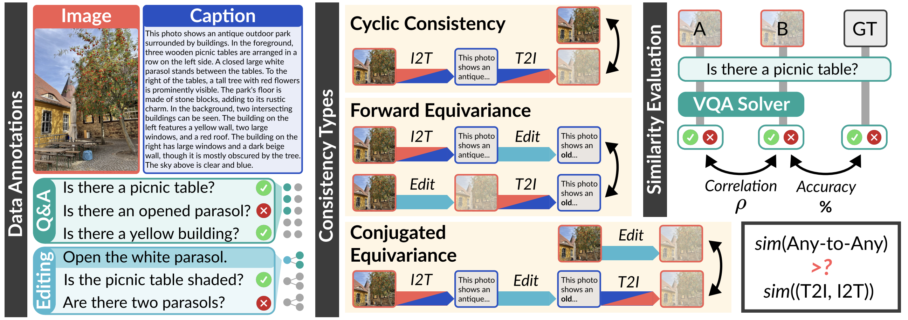

# Are Any-to-Any Models More Consistent Across Modality Transfers Than Specialists?


[](https://arxiv.org/abs/tbu) [](https://huggingface.co/datasets/jiwan-chung/ACON)

<p align="center">
  
</p>

## Coming Soon
- [x] Benchmark
- [ ] Inference Code


## Citation
If you find our work valuable, please cite:
```bibtex
@misc{chung2025dontlookoncemultimodal,
      title={Don't Look Only Once: Towards Multimodal Interactive Reasoning with Selective Visual Revisitation}, 
      author={Jiwan Chung and Junhyeok Kim and Siyeol Kim and Jaeyoung Lee and Min Soo Kim and Youngjae Yu},
      year={2025},
      eprint={2505.18842},
      archivePrefix={arXiv},
      primaryClass={cs.CL},
      url={https://arxiv.org/abs/2505.18842}, 
}
```
